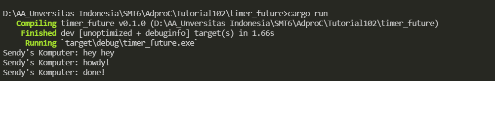
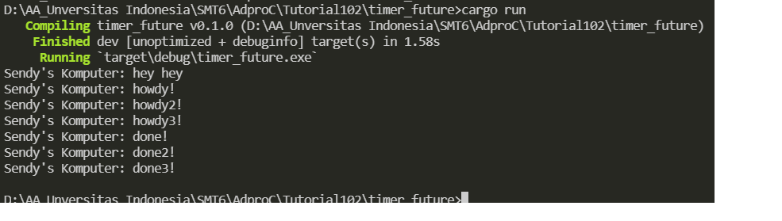
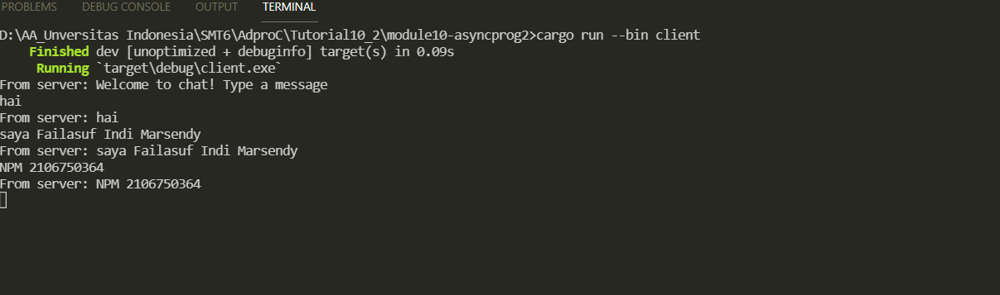
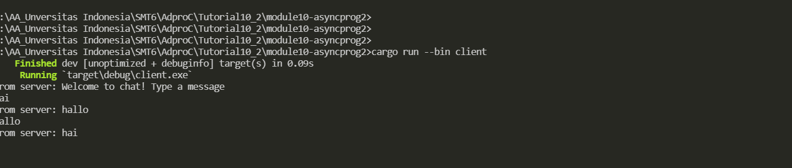
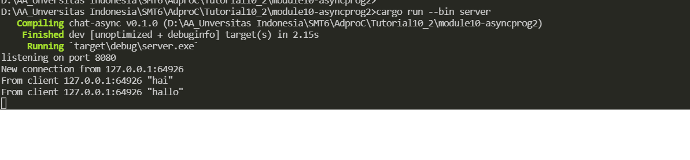

"# module10-asyncprog1" 

**## 1.2 Understanding how it works.**


- Program ini mengimplementasikan executor sederhana dengan spawner untuk mengelola dan menjalankan futures di Rust menggunakan lib futures. Ini adalah bagian dari pengembangan asynchronous programming di Rust.

- Yang terjadi adalah Sendy's Komputer: done! sedikit terlambat untuk dieksekusi karena menunggu asynchronous. Ini terjadi karena kode asyncronous menggunakan TimerFuture::new(Duration::new(2, 0)).await, yang artinya program akan menunggu selama 2 detik sebelum melanjutkan eksekusi setelah baris tersebut. Ini adalah sifat dari asynchronous programming di mana program dapat melanjutkan eksekusi selama menunggu operasi asynchronous selesai.


__## 1.3 Multiple Spawn and removing drop__



- Dengan menambahkan dua task tambahan,kita membuat program untuk menjalankan tiga operasi asynchronous secara konkuren. Masing-masing task mencetak "Sendy's Komputer: howdy!", "Sendy's Komputer: howdy2!", dan "Sendy's Komputer: howdy3!" sebelum menunggu selama 2 detik dan mencetak "Sendy's Komputer: done!", "Sendy's Komputer: done2!", dan "Sendy's Komputer: done3!" secara berturut-turut setelahnya.

- Dengan menghapus baris drop(spawner), kita tidak lagi memberi tahu executor bahwa tidak ada task baru yang akan dijadwalkan. Ini berarti executor akan terus berjalan dan menunggu task baru untuk dijalankan. Karena itu, executor akan menjalankan semua task yang sudah dijadwalkan (tiga task yang Anda spawn) sebelum akhirnya selesai dan program selesai berjalan.


__## 2.1 Original code of broadcast chat__



client.rs:

    - Kode ini menggunakan Tokio untuk membuat koneksi WebSocket ke ws://127.0.0.1:2000.
    - Setelah koneksi berhasil dibuat, kode ini menggunakan stdin (input dari terminal) untuk mengirim pesan ke server. Ini dilakukan melalui loop yang secara bersamaan menerima input dari stdin dan menerima pesan dari server melalui WebSocket.
    - Ketika pesan diterima dari server, kode akan mencetak pesan tersebut. Jika pesan yang diterima berupa teks, pesan tersebut akan dicetak dengan format "From server: [pesan]" di terminal.
    - Saat input diterima dari stdin, kode akan mengirim pesan ke server melalui WebSocket.

server.rs:

    - Kode ini menggunakan Tokio untuk membuat server WebSocket yang mendengarkan koneksi pada 127.0.0.1:2000.
    - Ketika koneksi baru diterima, server akan membuat WebSocket stream untuk koneksi tersebut.
    - Setelah koneksi WebSocket dibuat, server akan mengirim pesan sambutan ke client yang baru terkoneksi.
    - Server memiliki loop yang secara bersamaan menerima pesan dari client melalui WebSocket dan pesan yang di-broadcast ke semua client.
    -  Saat pesan diterima dari client, server akan mencetak pesan tersebut ke terminal dengan format "From client [alamat client]: [pesan]".
    - Saat pesan diterima dari broadcast channel (bcast_rx), server akan mengirim pesan tersebut ke semua client yang terkoneksi melalui WebSocket.

    

__## 2.2 Modifying the websocket port__
> File lain yang perlu dimodifikasi adalah server.rs karena itu adalah bagian dari aplikasi yang berperan sebagai server dalam koneksi websocket. Pada file server.rs, protokol websocket juga digunakan dengan import modul tokio_websockets::{Message, ServerBuilder, WebSocketStream};, yang menunjukkan bahwa protokol websocket yang sama digunakan di sini. Definisi protokol websocket ini juga dapat ditemukan di dalam modul tokio_websockets.


__## 2.3Small changes. Add some information to client__

### client view
- 
### server view
- 

Saya menambahkan seperti ini

```
let response = match text.trim().to_lowercase().as_str() {
    "hai" => "hallo",
    "hallo" => "hai",
};
bcast_tx.send(response.to_owned())?;

```


- match digunakan untuk membandingkan pesan dengan pola yang sudah ditentukan. Jika pesan adalah "hai", server akan merespons dengan "hallo". Jika pesan adalah "hallo", server akan merespons dengan "hai".
- bcast_tx.send(response.to_owned())? digunakan untuk mengirimkan respons dari server ke client menggunakan channel broadcast.